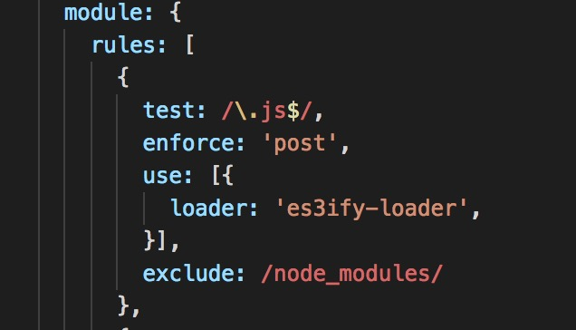
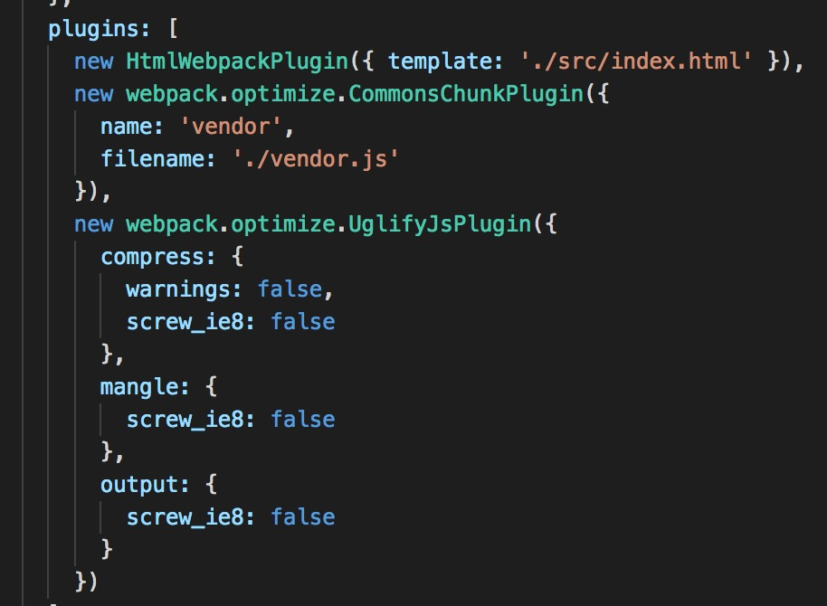
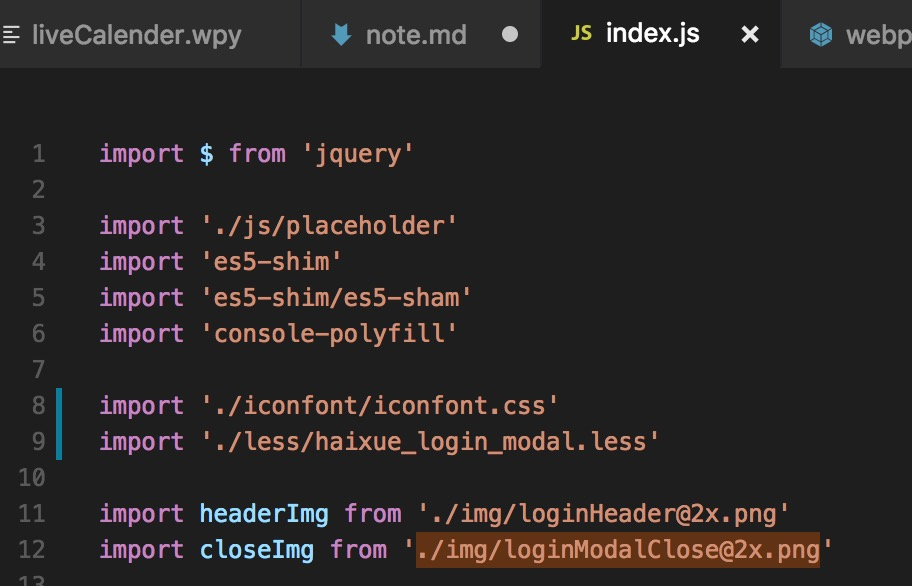

正常配置 webpack 打包后在 ie8 中报 *标识符错误*。

这里遇到第一个问题： default 为 ie8 保留字，需要把 `object.default` 改为 `object["default"]`。
解决步骤：

1.使用 es3ify-loader 或者 es3ify-webpack-plugin 进行上述代码更改。（es3ify-webpack-plugin 作者推荐使用 es3ify-loader）   
    
2.webpack.optimize.UglifyJsPlugin 压缩选项支持 ie8 。（uglifyjs-webpack-plugin 文档内也支持 ie8 打包模式，但实际操作中未成功）   
    

再次打包进入 ie8 ，会遇到第二个问题： `object.keys` 报 *对象不支持该属性或方法*。
解决步骤：

1.在项目入口 index.js 中使用 es5-shim 和 es5-shim/es5-sham。   
    
2.还可以同时引入一些 polyfill 如： console-polyfill 保证一些辅助功能

至此，打包进入 ie8 就能正常显示页面了。
